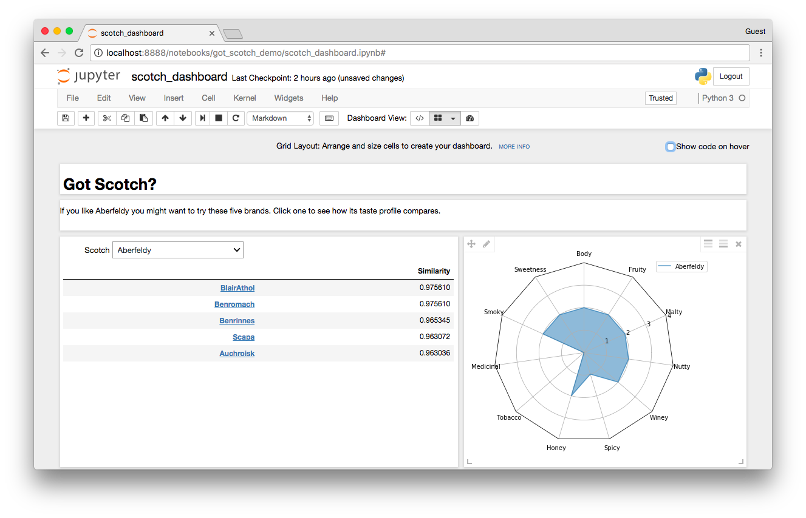

# Jupyter Dashboards - Layout Extension

[](https://badge.fury.io/py/jupyter_dashboards) [](https://travis-ci.org/jupyter-incubator/dashboards) [](https://groups.google.com/forum/#!forum/jupyter)

## Overview

The dashboards layout extension is an add-on for Jupyter Notebook. It lets you arrange your notebook outputs (text, plots, widgets, ...) in grid- or report-like layouts. It saves information about your layouts in your notebook document. Other people with the extension can open your notebook and view your layouts.



The extension is part of the larger Jupyter Dashboards effort which covers:

1. Arranging notebook outputs in a grid- or report-like layout 
2. Bundling notebooks and associated assets for deployment as dashboards 
3. Serving notebook-defined dashboards as standalone web apps

This repository focuses on (1) above, while [jupyter-incubator/dashboards_bundlers](https://github.com/jupyter-incubator/dashboards_bundlers) handles (2) and [jupyter-incubator/dashboards_server](https://github.com/jupyter-incubator/dashboards_server) implements (3).

See the [Understanding the use case](http://jupyter-dashboards-layout.readthedocs.io/en/latest/use-cases.html) documentation page for more background information.

## Installation

Detailed installation instructions appear in the [Getting started page](http://jupyter-dashboards-layout.readthedocs.io/en/latest/getting-started.html) of the project docs. Here's a quick-start snippet using pip and Jupyter Notebook 4.2:

```bash
# install from pypi
pip install jupyter_dashboards

# activate it in the current python environment
jupyter dashboards quick-setup --sys-prefix
``` 

If you want to try the dashboard extension and demos without installing it yourself, visit the [jupyter-incubator/showcase binder](http://mybinder.org/repo/jupyter-incubator/showcase). If the binder site is full, try the tmpnb instance at [http://jupyter.cloudet.xyz](http://jupyter.cloudet.xyz).

Note that both of these deployments tend to lag the latest stable release.

## Contributing

The [Development page](http://jupyter-dashboards-layout.readthedocs.io/en/latest/development.html) includes information about setting up a dev environment and typical dev tasks.
