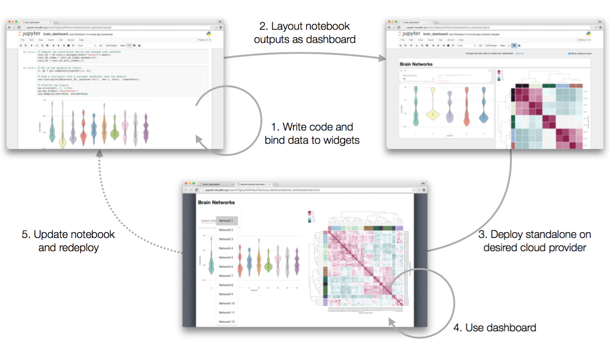

## Understanding the use case

The dashboard layout extension is part of a larger Jupyter Dashboards effort meant to address the following problem:

> Alice is a Jupyter Notebook user. Alice prototypes data access, modeling, plotting, interactivity, etc. in a notebook. Now Alice needs to deliver a dynamic dashboard for non-notebook users. Today, Alice must step outside Jupyter Notebook and build a separate web application. Alice cannot directly transform her notebook into a secure, standalone dashboard application.

The solution implemented by the Dashboards effort is the following:

1. Alice authors a notebook document using Jupyter Notebook. She adds visualizations and interactive widgets.
2. Alice arranges her notebook cells in a grid- or report-like dashboard layout.
3. Alice one-click deploys her notebook and associated assets to a Jupyter Dashboards server.
4. Bob visits the dashboards server and interacts with Alice's notebook-turned-dashboard application.
5. Alice updates her notebook with new features and redeploys it to the dashboards server.

The ecosystem of widget and visualization libraries for Jupyter Notebook covers step (1). The dashboard layout extension handles step (2). The other projects in the Jupyter Dashboards effort, namely the [dashboard bundlers](https://github.com/jupyter-incubator/dashboards_bundlers) and [dashboard server](https://github.com/jupyter-incubator/dashboards_server) handle the remaining steps (3) through (5).
