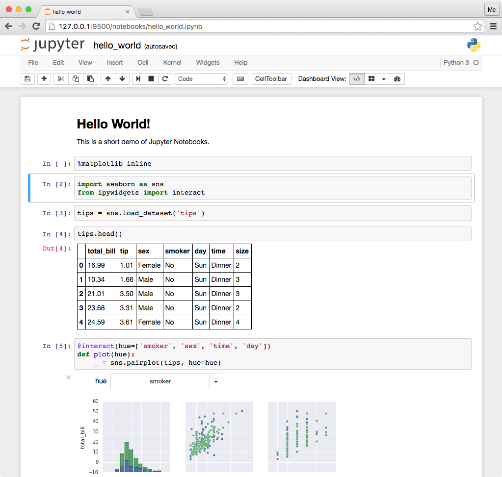
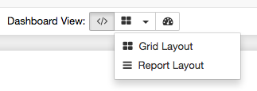
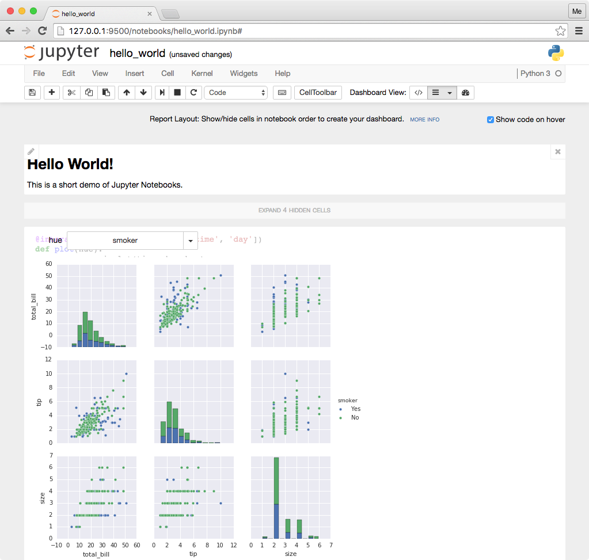
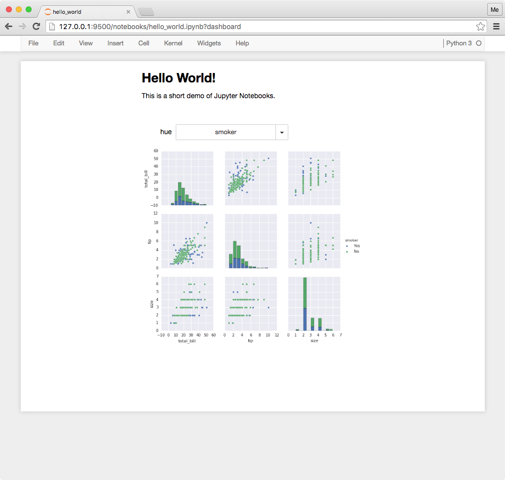

# Creating dashboard layouts

This page provides a brief walkthrough of using the dashboard extension. The extension provides additional, built-in help about all of the dashboard features. The steps below include instructions on how to access the help.

1. Create a new Jupyter notebook document in an language of your choose.
2. Insert markdown and code into the notebook. Run the cells to generate text, plots, widgets, etc.  
    
3. Select either *Grid Layout* or *Report Layout* in the *Dashboard View* toolbar. Alternatively, use the options in the *View -> Dashboard Layout* menu.  
    
4. In grid layout, drag handles to resize and move cells in the grid. Click the buttons to add or remove cells in the layout. Use the *Cell -> Dashboard* menu items for batch operations.  
    
5. In report layout, click buttons to show or hide cells.  
    
6. Click *More Info* at the top of the layout view for help with additional features.  
    
7. Click the *Dashboard Preview* button in the toolbar to view and interact with the cells without the authoring tools. Alternatively, click the *Dashboard Preview* menu item in the *View* menu.  
    
8. Click the *Notebook View* button in the toolbar to return to the notebook editor. Alternatively, click the *Notebook* menu item in the *View* menu.  
    
